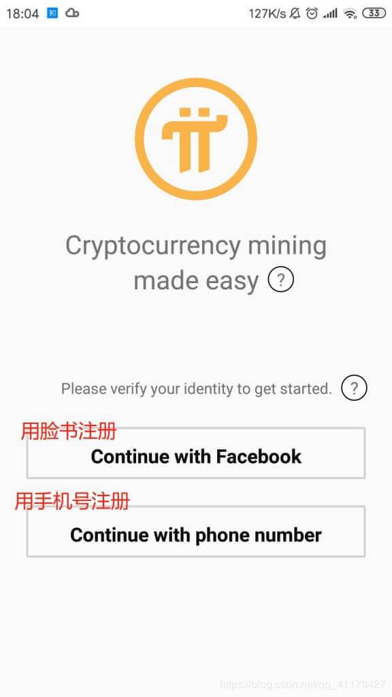
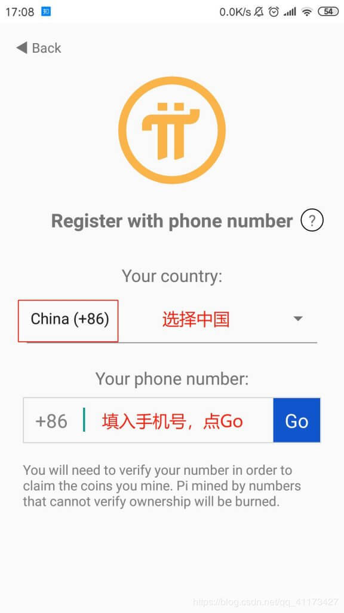
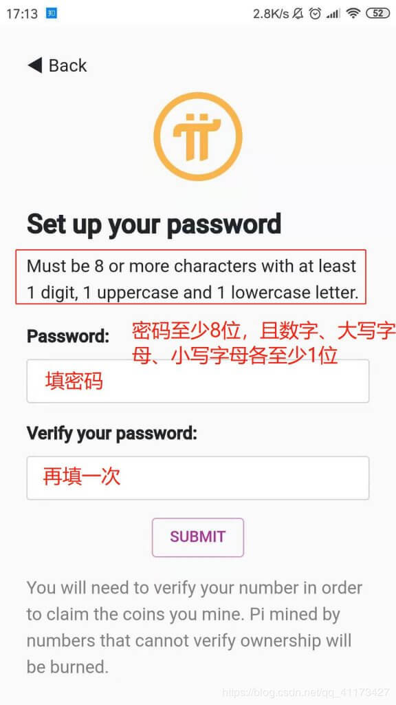
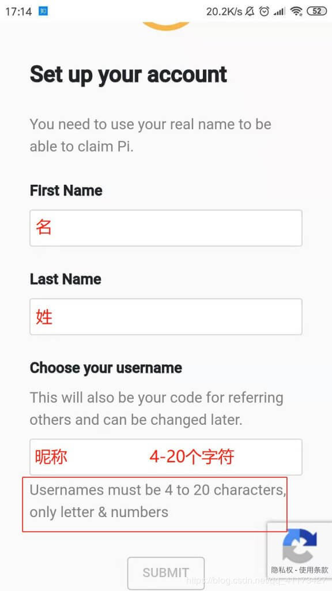
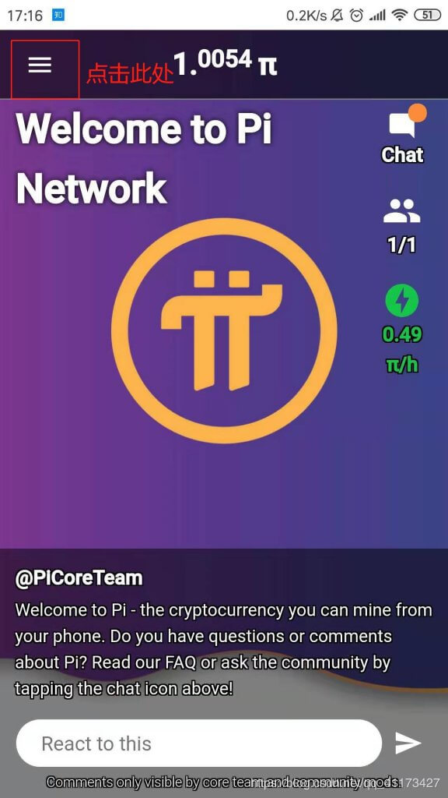
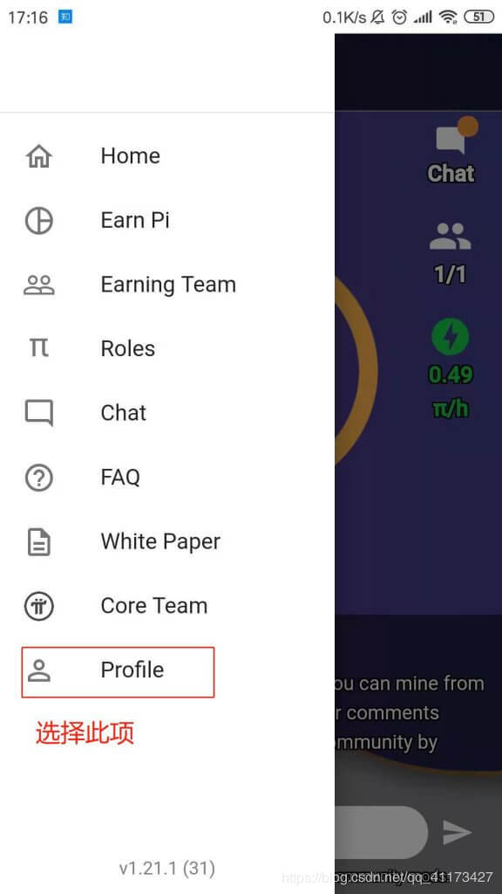
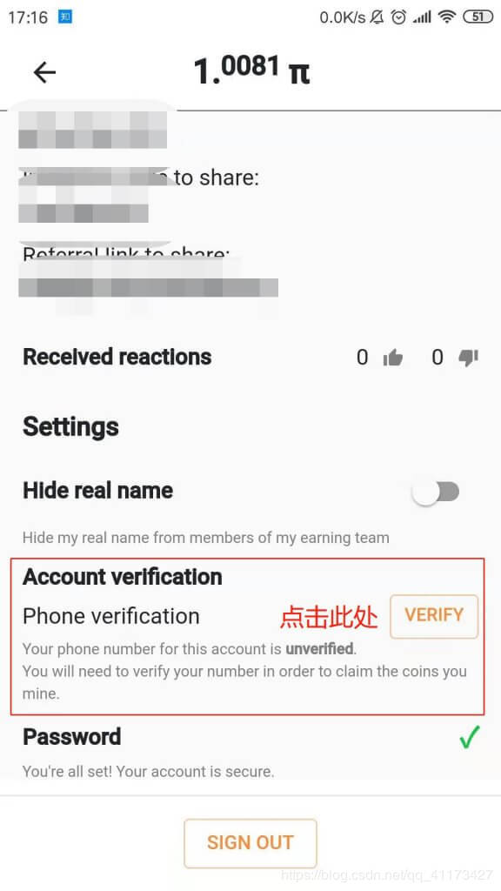
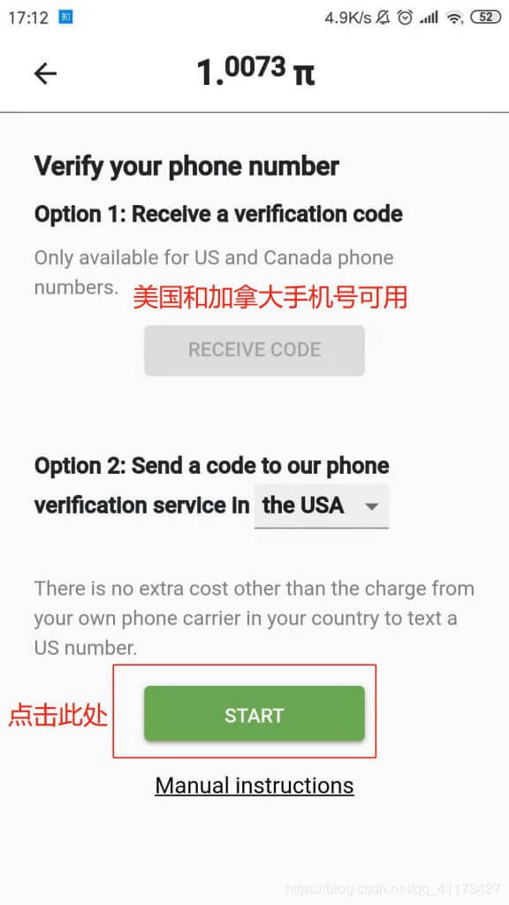
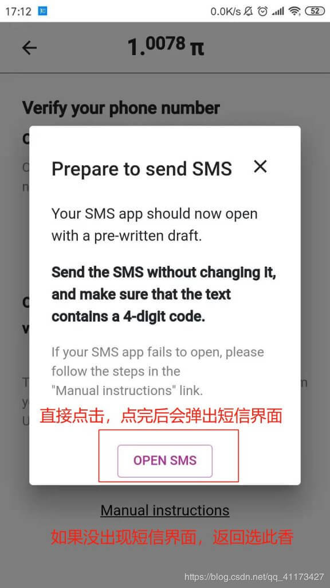
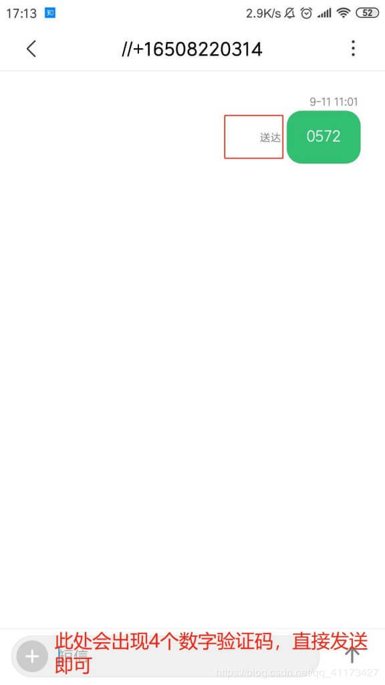

## 一、pi币APP下载的方法

(1)安卓手机下载链接 https://www.lanzous.com/ia0onli

(2)苹果手机下载链接https://minepi.com/#download

 

## 二、用户注册方法
(1)选择用脸书账号注册还是手机号注册，这里推荐用手机号注册，方便后续操作。

 

(2)选择中国，输入手机号，点击Go。

 

(3)设置密码和确认密码，两遍密码输入完成后，点击SUBMIT。(密码至少8位，数字、大写字母、小写字母都至少有一位，例如：Sunshine123)

(4)依次输入名、姓、昵称，点击SUBMIT。(名和姓可以输入中文，要填真实姓名，需要验证,昵称4-20个字符)

 

 

(5)填入邀请码：probie，点击SUBMIT。(可免费获取一个pi币，3天后邀请你加入安全圈，挖矿速度翻倍)

 

 

 

(6)走完软件的引导流程要验证手机号

 

## 三、验证
(1)点击左上角的三道杠，弹出菜单栏

(2)选择Profile项。

 

(3)点击倒数第二项的VERIFY。

(4)点击绿色的START。

(5)点击OPEN SMS。

 

(6)发送短信，验证成功。(由于是国际短信，需要5角钱)

 

## 四、注意事项
新用户如何创建pi币安全圈，增加算力

【1】注册pi币账户，启动矿机

【2】挖矿3天，{挖矿72小时后} 才能开启安全圈

【3】安全圈添加一个好友，算力提升20%，最多提升100%(加五个好友) 算力：0.98/h  好友添加完以后算力在下一次点击闪电后生效

【4】挖矿3天，{挖矿72小时后} 才能开启安全圈，增加算力挖矿翻倍  

温馨提示：

1、记得每24小时内上去点一下【绿色闪电】去收矿！注册成功72小时以后开启安全圈算了可以翻倍

2、未来团队会开发钱包功能，到时候你就可以把币转进你的钱包，由你自己保管。目前挖矿无需任何金钱成本，所以小伙伴们赶快行动起来，抓住项目早期的红利吧！自己的邀请码在菜单里的‘Profile’

3、注册后一定要进行手机号认证！否则挖的币会被系统销毁

4、目前已知一个pi币为5美元